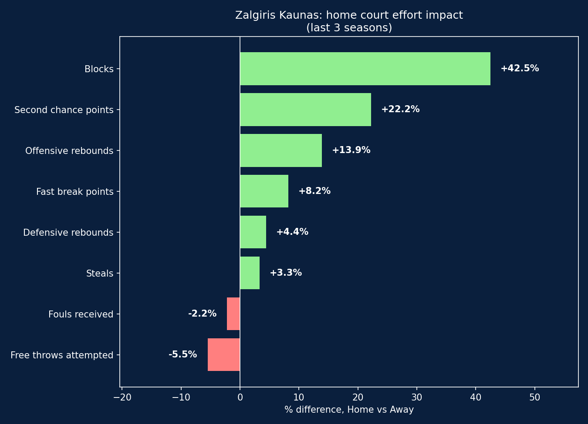
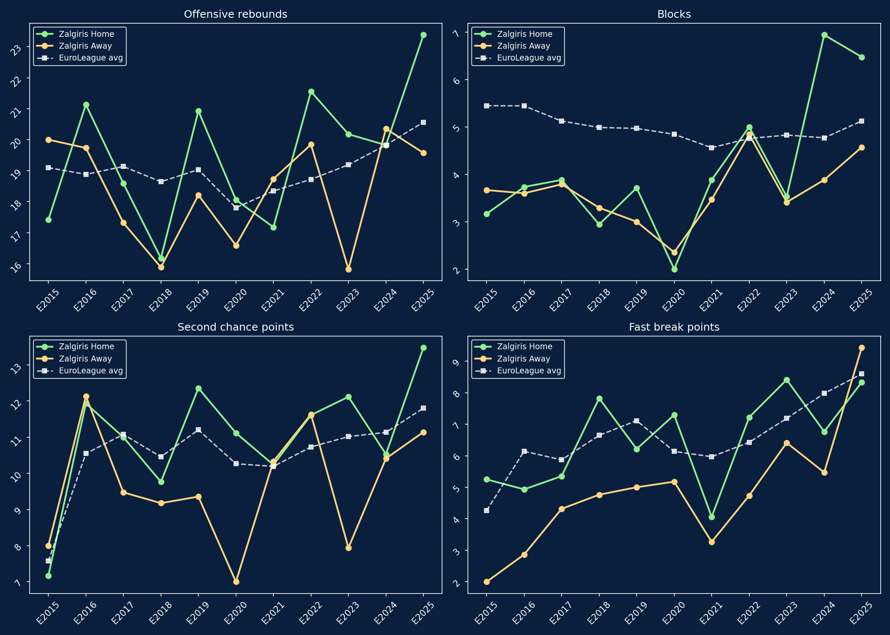

# Zalgiris Kaunas: The Home Court Effort Effect

A data-driven look at how home court advantage shows up in "effort" statistics - rebounds, steals, blocks, transition scoring - for Zalgiris Kaunas, one of EuroLeague's most notoriously loud home crowds.

## Background

The Zalgirio Arena in Kaunas is widely regarded as one of the most intense atmospheres in European basketball. This project tests a simple hypothesis: does that atmosphere show up in stats driven by hustle and athleticism (rebounds, steals, blocks, fast break points) more than in stats influenced by other factors (fouls, free throws)?

The analysis starts with the last 3 seasons, then extends to 11 seasons (2015-2025) to separate real trends from season-to-season noise, and compares Zalgiris to the EuroLeague-wide average.

## Data & Tools

- **Data source**: [Euroleague & Eurocup Datasets](https://www.kaggle.com/datasets/babissamothrakis/euroleague-datasets) (Kaggle)
- **Tools**: Python, pandas, matplotlib
- **Scope**: 365 Zalgiris games (2015-2025), plus league-wide box score and comparison data for the same period

## Home vs Away: Last 3 Seasons

Looking at the last 3 seasons (2023-24 to 2025-26), the pattern is clear but not uniform:

| Stat | Home vs Away |
|---|---|
| Blocks | +42.5% |
| Second chance points | +22.2% |
| Offensive rebounds | +13.9% |
| Fast break points | +8.2% |
| Defensive rebounds | +4.4% |
| Steals | +3.3% |
| Fouls received | -2.2% |
| Free throws attempted | -5.5% |

Effort-driven stats (blocks, rebounds, second chance points) are consistently higher at home. Referee-influenced stats (fouls received, free throws attempted) are not (if anything, they're slightly *lower* at home). This pushes back on the common assumption that a loud home crowd sways officiating; for Zalgiris, it doesn't seem to.

## From 3 Seasons to 11: Signal vs Noise

With only 3 seasons of data, some stats, fast break points in particular, looked unstable, even reversing direction in the most recent season. Extending the analysis to 11 seasons (2015-2025, 365 games) tells a clearer story.

A few things stand out once more data is added:

- **Second chance points and offensive rebounds** show a fairly consistent home advantage across most seasons, confirming what the 3-season snapshot suggested.
- **Fast break points** reveal the clearest structural pattern: Zalgiris' home fast break scoring pulls further ahead of the EuroLeague average from around 2018 onward (the "unstable" signal seen in the 3-season view turns out to be the peak of a long, consistent trend, not an anomaly).
- **Blocks** show a sharp jump in the last two seasons, with Zalgiris at home outpacing the league average by a wide margin, worth noting as a recent development rather than a long-standing pattern.
- **2020-2021 dip**: several stats drop noticeably in these two seasons, coinciding with COVID-era games played with reduced or no crowds. This is a useful reminder that "home court advantage" assumes fans are actually present, a caveat worth keeping in mind when reading any home/away split from that period.

## The Bigger Picture: A Faster EuroLeague

The league-wide average for fast break points more than doubled between 2015 (4.3 per team per game) and 2024-25 (9.0), a trend visible independently of Zalgiris. This lines up with a broader shift toward a faster, more transition-heavy style of play across EuroLeague over the past decade, not just at Zalgirio Arena, but league-wide.

## Takeaways

- Effort-driven stats (rebounds, blocks, second chance points) show a real home court advantage for Zalgiris; referee-influenced stats (fouls, free throws) do not
- A 3-season sample isn't enough to distinguish genuine trends from noise: extending to 11 seasons clarified patterns that looked unstable at first, especially for fast break points
- The EuroLeague as a whole has become significantly faster-paced over the last decade; Zalgiris' home performance in transition has grown even faster than the league average
- COVID-era seasons (2020-21) show a visible dip across several metrics, likely linked to reduced crowd presence

## How to Reproduce

1. Download the [Euroleague & Eurocup Datasets](https://www.kaggle.com/datasets/babissamothrakis/euroleague-datasets) from Kaggle
2. Place `euroleague_header.csv`, `euroleague_box_score.csv`, and `euroleague_comparison.csv` in the project folder
3. Run `zalgiris_home_effort.py`

## About

This project combines a background in basketball coaching (8 years, youth and regional level) with data analysis. See also: [Olympiacos 2025-26: A Shot Data Analysis](https://github.com/viare21/euroleague-shot-analysis), a related project on shot selection and efficiency.
